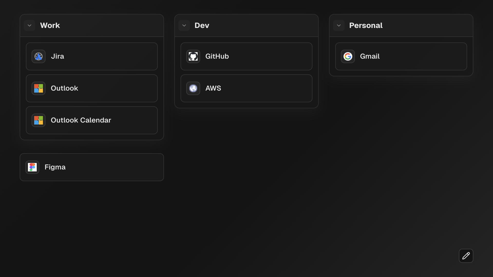

# New Tab

<p align="center">
	
</p>

## How to use it

New Tab is a local-first start page for the links you open every day. Open the built page, then use it as your browser's new-tab page. The first launch includes a few example bookmarks that you can replace with your own.

Bookmark data and layout settings are saved in your browser's local storage.

## Setup

Install the dependencies:

```bash
npm install
```


To create a build for local new-tab use:

```bash
npm run build
```

Open `dist/index.html` directly in a browser or configure it as your local new-tab page. The build uses relative asset paths so it works with `file://` URLs.

## Using the tool

- **Open a bookmark:** In normal mode, select any bookmark to open its URL.
- **Enter edit mode:** Select the pencil button. Select the check button when you are finished.
- **Add bookmarks:** Choose **Bookmark**, enter a title and a URL, then optionally assign it to a section.
- **Layout:** Other layout options are available in edit mode.

## Development

Run the checks and production preview with:

```bash
npm run lint
npm run build
npm run preview
```

For local development, start Vite and open `http://127.0.0.1:5173`:

```bash
npm run dev
```

The development server supports Vite hot reload while source files change. The preview server serves the production build locally.
